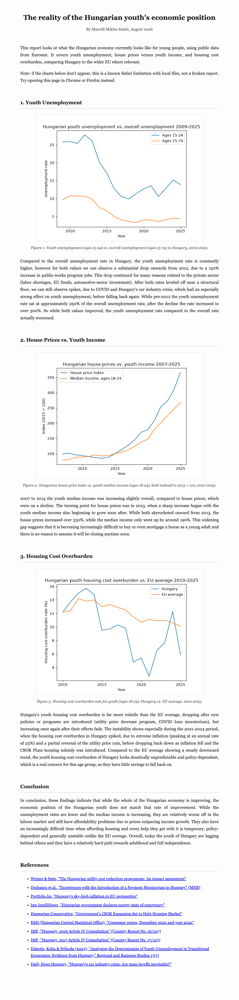

# Hungarian Youth Economic Conditions: Economic Data Analysis

This project looks at what the Hungarian economy currently looks like for young people. It pulls public data from Eurostat, cleans and analyzes it with pandas, and turns it into an HTML report with charts covering youth unemployment, house prices, and housing affordability.

The goal was to work with real, messy economic data end to end: pulling it from an API, cleaning it, and turning it into something readable, rather than working with a pre-cleaned dataset.

## Report preview

## What it covers

- Youth unemployment vs. the overall population, using Eurostat's annual unemployment data
- House price trends over time
- Housing cost overburden for young people in Hungary compared to the EU average

## Viewing the report

The finished report is `report/report.html`. GitHub doesn't display HTML files
directly, so to view it:

1. On this page, click the green "Code" button, then "Download ZIP".
2. Unzip the downloaded folder.
3. Open `report/report.html` in a web browser (double-click it, or right-click
   and choose "Open with" your browser). Chrome or Firefox are recommended -
   Safari has a known issue where the chart images won't display for local
   files like this one.

## Tech stack

Python, pandas, matplotlib, and the Eurostat API (via the `eurostat` package). Everything runs locally with no paid services involved.

## Status

Complete. Built step by step as a hands-on exercise in applied data analysis for economics.

## Why I built this

I've always been interested in economics, and wanted to build a project that goes beyond a generic coding exercise by applying real data analysis to an actual economic question.

## A note on AI use

I used Claude to help write this README, make the HTML page, and learn pandas and matplotlib along the way. All the code itself was written by me.
